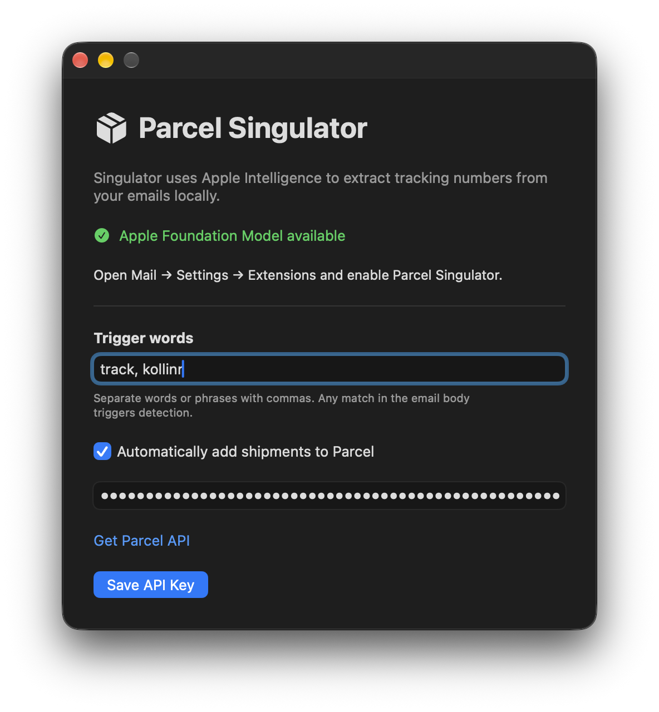

	 
	
	<h1>Parcel Singulator</h1>
	

		<b>Automatically extract tracking numbers from Apple Mail and add them to Parcel </b>
	

	 
	 
	 

Parcel Singulator is a native macOS app and Apple Mail extension that extracts tracking numbers, carriers, and item names locally with Apple Intelligence. View shipment details inside Mail or automatically add deliveries to Parcel.

*Requires macOS 26.6 or later and an Apple Intelligence-capable Mac with Apple Intelligence enabled and its model downloaded. Building requires Xcode with support for that deployment target and Foundation Models.*

Open a shipping email and choose “Extract details” to view its tracking number, carrier, and item name. To import deliveries automatically, enable “Automatically add shipments to Parcel” in the app and save your Parcel application programming interface key. The key is validated and stored in the shared Keychain.

New shipping messages are checked against active Parcel deliveries before a shipment is added. Successful imports and existing deliveries are marked as read when processing completes through Mail's message action. Extraction handles one shipment per message and declines uncertain results. Emails that require signin to track are not supported.
